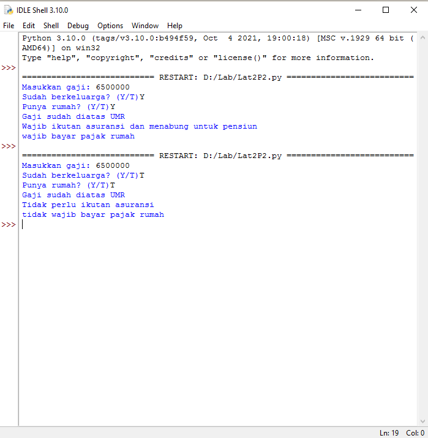
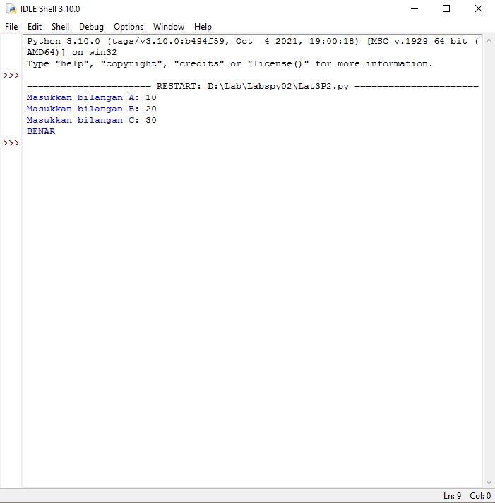

# Labspy02

### Profil
__Nama  : Nabilah Ananda Putri__

__Nim   : 312110263__

__Kelas : T1.21.A.1__

#### Daftar Isi
| No | ISI | 
| -- | --- |
| 1. |  Praktikum2  | 
| 2. |  Latihan1  |
| 3. |  Latihan2  |

## Tugas Praktikum 2
- Membuat program sederhana dengan input tuga buat bilangan, dari ketiga bilangan tersebut tampilkan bilangan terbesarnya. 

#### Flowchart


#### Program

```bash
print("Program mencari bilangan terbesar") 

a = int(input("Masukan nilai a: "))
b = int(input("Masukan nilai b: "))
c = int(input("Masukan nilai c: "))

if a > b and a > c:
    print ("A yang terbesar")
elif b > a and b > c:
    print ("B yang terbesar")
else:
    print("C yang terbesar")
```

#### Output


## Latihan1
- Membuat program yang menentukan nilai akhir

#### Program 

```bash
nama = input("Masukkan nama:")
uts = input("Masukkan nilai UTS:")
uas = input("Masukkan nilai UAS:")
tugas = input("Masukkan nilai Tugas:")

akhir = (int(tugas) * .2) + (int(uts) * .4) + (int(uas) * .4)
keterangan = ("TIDAK LULUS", "LULUS")[akhir > 60.0]
if akhir > 80:
    huruf = "A"
elif akhir > 70:
    huruf = "B"
elif akhir > 50:
    huruf = "C"
elif akhir > 40:
    huruf = "D"
else:
    huruf = "E"

print("\nNama :",nama)
print("Nilai UTS :",uts)
print("Nilai UAS :",uas)
print("Nilai Tugas :",tugas)
print("Nilai Akhir :",akhir)
print("\nNilai Huruf :",huruf)
print("Keterangan :",keterangan)
```

#### Output


## Latihan2
- Membuat program menampilkan status gaji karyawan

#### Program

```bash 
gaji = int(input("Masukkan gaji:"))
berkeluarga = (False, True)[input("Sudah berkeluarga? (Y/T)") == "Y"]
punya_rumah = (False, True)[input("Punya rumah? (Y/T)") == "Y"]

if gaji > 3000000:
    print ("Gaji sudah diatas UMR")
    if berkeluarga:
        print ("Wajib ikutan asuransi dan menabung untuk pensiun")
    else:
        print ("Tidak perlu ikutan asuransi")
        
    if punya_rumah:
        print ("wajib bayar pajak rumah")

    else:
        print ("tidak wajib bayar pajak rumah")
else:
    print ("Gaji belum UMR")
```

#### Output



## Latihan3
- Membuat Program membandingkan 3 input bilangan

#### Program

```bash
a = int(input("Masukkan bilangan A: "))
b = int(input("Masukkan bilangan B: "))
c = int(input("Masukkan bilangan C: "))
if a+b == c or b+c == a or c+a == b:
    print("BENAR")
else:
    print("SALAH")
```

#### Output


## Terima kasih