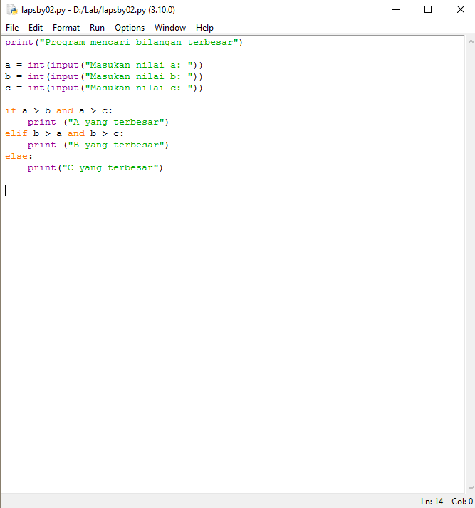
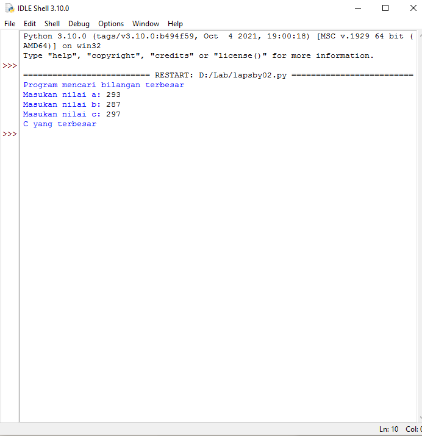
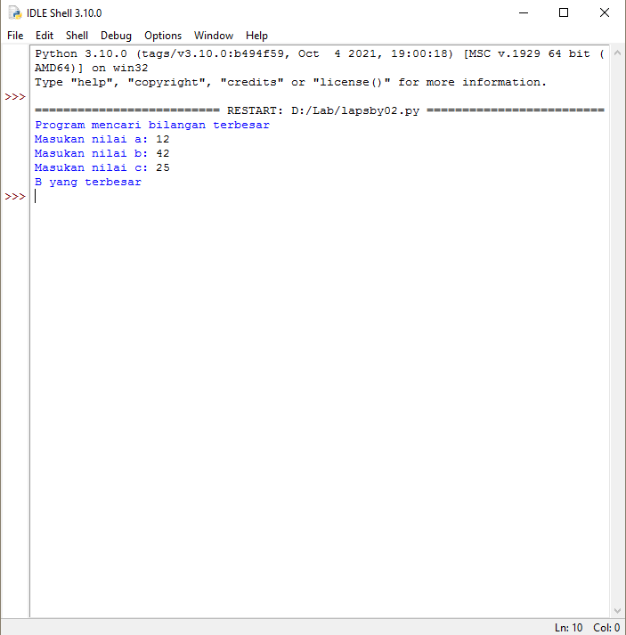
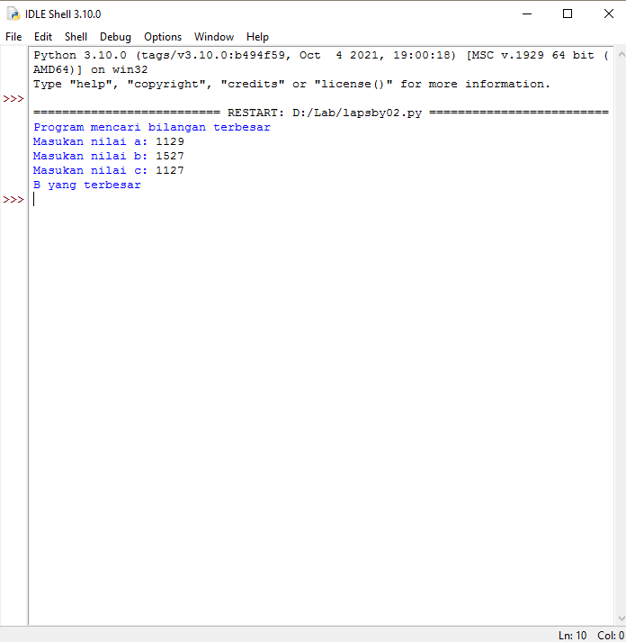
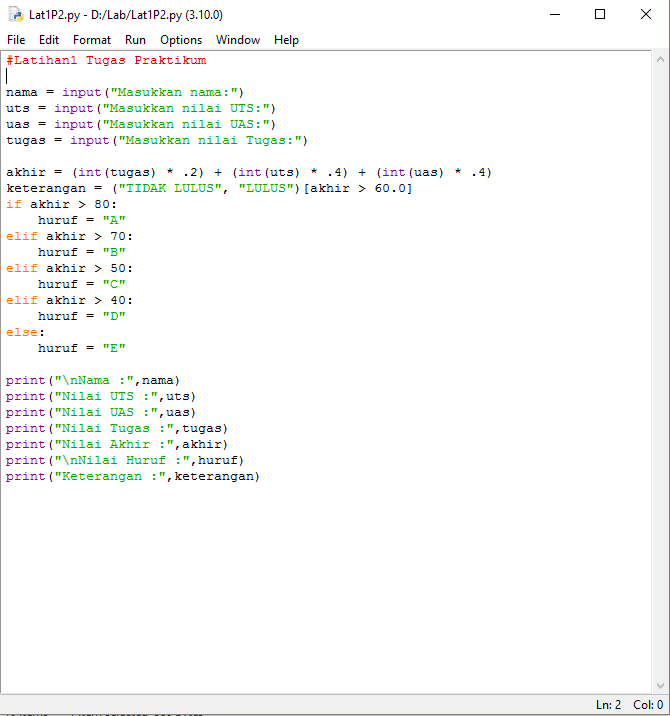
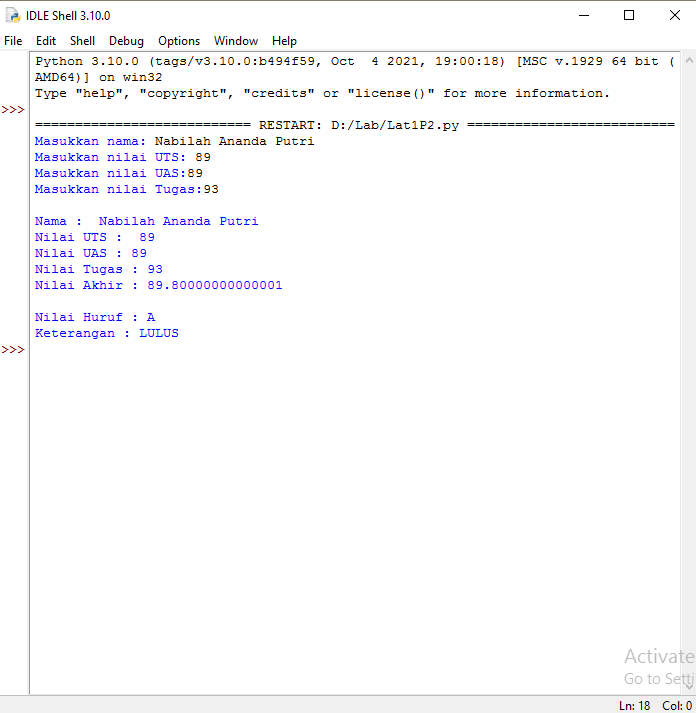
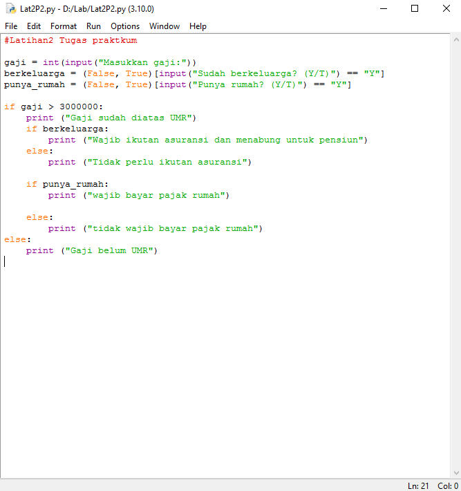
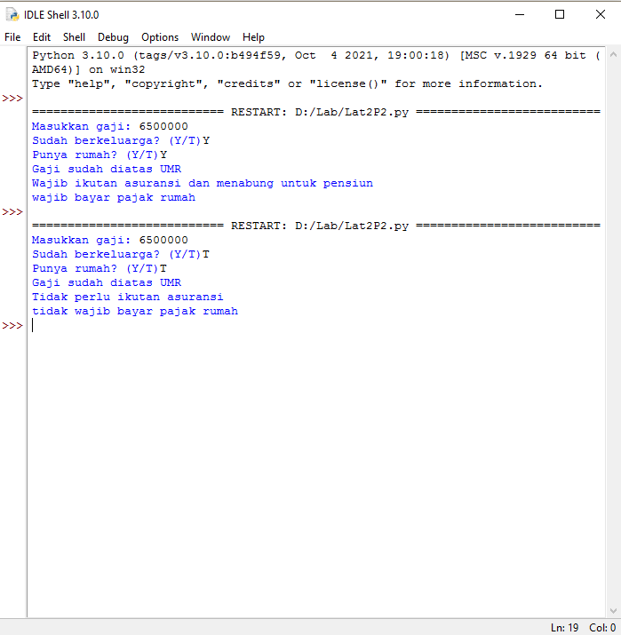
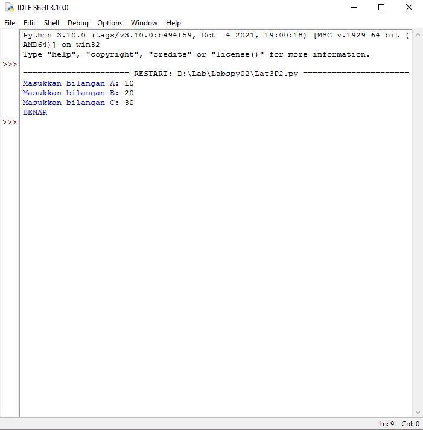

# Labspy02

## Tugas Praktikum 2
### Program input tiga buat bilangan
#### Flowchart

#### Program

#### Output

## Latihan1
### Program menentukan nilai akhir
#### Program 

#### Output

## Latihan2
### Program menampilkan status gaji karyawan
#### Program

#### Output

## Latihan3
### Program membandingkan 3 input bilangan
#### Program

#### Output

## Terima kasih